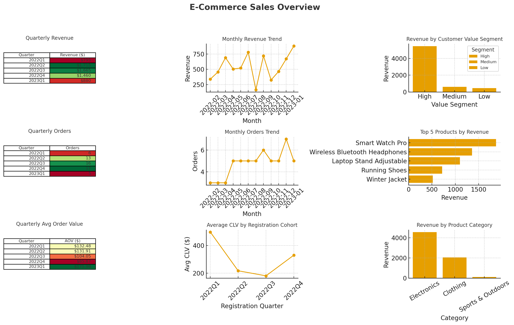

# mysql-powerbi-excel-project

A complete end-to-end data analytics project analyzing e-commerce sales performance, customer segmentation, product trends, and geographic patterns using MySQL, Excel, and Power BI.

👉 Goal: Identify revenue opportunities and improve customer retention through data-driven insights.

🛠️ Tech Stack

MySQL – database design, data cleaning, transformation, analysis

Excel – pivot tables, KPIs, cohort analysis

Power BI – interactive dashboards with DAX

SQL – window functions, views, aggregations

📊 Key Features

Customer segmentation (value, engagement, frequency)

Revenue & product performance analysis

Geographic sales insights

Cohort retention analysis

End-to-end workflow: SQL → Excel → Power BI

🖥️ Dashboard Preview

  

📂 Project Files

Database schema & sample data

SQL cleaning, transformation, and business analysis

Excel and Power BI guides

Business insights & recommendations

📖 Detailed Documentation

To keep this README clean, full documentation is available in separate files:

Project Summary → PROJECT_SUMMARY.md

Insights & Recommendations → Business_Insights_and_Recommendations.md

SQL Scripts → /sql_queries/

Power BI Guide → Power_BI_Dashboard_Guide.md

Excel Guide → Excel_Workbook_Guide.md

Setup Steps → SETUP_GUIDE.md

🎯 Skills Demonstrated

Database design & normalization

SQL analytics using window functions & views

Data quality validation

Power BI dashboard building

Business intelligence storytelling

📈 Results (Brief)

High-value customers = ~60% of revenue

Electronics category leads performance

California & Texas are strongest states

Cohort retention declines without targeted re-engagement

📄 License

MIT License
